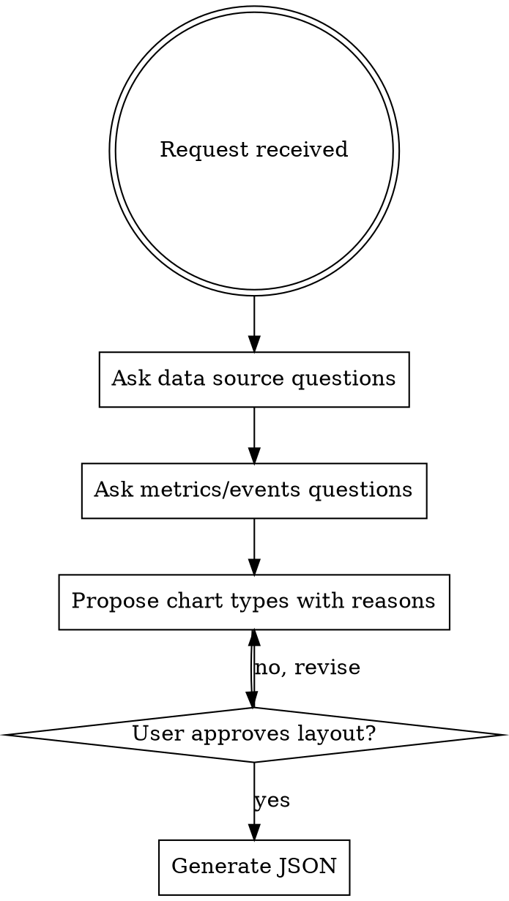

# Grafana Dashboard

## Overview

Build Grafana dashboards through dialogue: ask about data and purpose first, recommend chart types with reasoning, then generate the JSON. Never skip the questioning phase — the right chart depends on what decision the dashboard supports.

## Process



**One question per message.** Don't list all questions at once.

## Questions to Ask (in order)

### 1. Data Sources

-   "Os dados vêm do Loki (logs), MySQL, ou ambos?"
-   If Loki: "Qual o `identifier` ou campo nos logs que identifica esses eventos?"
-   If MySQL: "Qual tabela e campo representam esse evento?"

### 2. What Decisions the Dashboard Supports

-   "Que pergunta você quer responder com esse dashboard?" (funil de conversão? saúde do pipeline? debugging?)
-   This determines whether you need counters, trends, or drill-down logs.

### 3. Time Dimension

-   "Os dados precisam de série temporal (tendência ao longo do tempo) ou só totais acumulados?"

### 4. Segments / Breakdowns

-   "Você quer quebrar por algum atributo? (ex: por empresa, por canal, por tipo)"

## Chart Type Recommendations

| Goal                        | Recommended panel                   | LogQL / SQL pattern                    |
| --------------------------- | ----------------------------------- | -------------------------------------- |
| Total acumulado no período  | `stat` (graphMode: none)            | `sum(count_over_time(... [$__range]))` |
| Taxa / percentual           | `stat` (unit: percent)              | `(A / B) * 100`                        |
| Tendência ao longo do tempo | `timeseries`                        | `sum(rate(... [$__interval]))`         |
| Funil de conversão          | Linha de `stat` panels em sequência | um painel por etapa                    |
| Logs para debugging         | `logs` panel                        | `{...} \| identifier=~"..."`           |
| Distribuição por categoria  | `bar chart` ou `pie chart`          | GROUP BY no SQL                        |
| Lista de registros          | `table`                             | SELECT com colunas relevantes          |

**Sempre inclua uma seção de logs brutos** no final do dashboard — facilita debugging de qualquer anomalia nos contadores.

## Standard Layout

```
Row: "Seção 1 — Nome (Loki/MySQL)"
  stat stat stat stat stat stat    ← y=1, h=5, w=4 cada
  stat stat stat stat stat stat    ← y=6 se precisar de mais
  timeseries (w=24)                ← y=11, h=8

Row: "Seção 2 — ..."
  ...

Row: "Logs — Troubleshooting (Loki)"
  logs panel (w=24, h=10)          ← sempre última seção
```

**Grid:** largura total = 24. Cards típicos: w=4 (6 por linha) ou w=6 (4 por linha).

## Standard Variables (this project)

```json
{
    "templating": {
        "list": [
            {
                "label": "Loki",
                "name": "ds_loki",
                "query": "loki",
                "type": "datasource"
            },
            {
                "label": "MySQL",
                "name": "ds_mysql",
                "query": "mysql",
                "type": "datasource"
            },
            {
                "allValue": ".+",
                "label": "Serviço (Loki)",
                "name": "loki_service",
                "definition": "label_values(service_name)",
                "datasource": { "type": "loki", "uid": "${ds_loki}" },
                "query": "label_values(service_name)",
                "type": "query",
                "refresh": 1,
                "sort": 1
            }
        ]
    }
}
```

Include only the variables actually used. Loki-only dashboards don't need `ds_mysql`.

## Standard Panel Skeleton

### Stat (Loki counter)

```json
{
    "datasource": { "type": "loki", "uid": "${ds_loki}" },
    "type": "stat",
    "pluginVersion": "11.6.0",
    "options": {
        "colorMode": "background",
        "graphMode": "none",
        "justifyMode": "auto",
        "orientation": "auto",
        "wideLayout": true,
        "reduceOptions": { "calcs": ["lastNotNull"], "fields": "", "values": false }
    },
    "fieldConfig": {
        "defaults": {
            "color": { "mode": "thresholds" },
            "unit": "short",
            "thresholds": { "mode": "absolute", "steps": [{ "color": "blue" }] }
        },
        "overrides": []
    },
    "targets": [
        {
            "datasource": { "type": "loki", "uid": "${ds_loki}" },
            "expr": "sum(count_over_time({service_name=~\"$loki_service\"} | identifier=\"IDENTIFIER_HERE\" [$__range]))",
            "format": "table",
            "instant": true,
            "queryType": "instant",
            "refId": "A"
        }
    ]
}
```

### Timeseries (Loki rate)

```json
{
    "type": "timeseries",
    "targets": [
        {
            "expr": "sum(rate({service_name=~\"$loki_service\"} | identifier=\"IDENTIFIER_HERE\" [$__interval]))",
            "legendFormat": "label aqui",
            "refId": "A"
        }
    ],
    "options": {
        "legend": { "calcs": ["sum", "max"], "displayMode": "table", "placement": "bottom", "showLegend": true },
        "tooltip": { "mode": "multi", "sort": "desc" }
    }
}
```

### Logs panel

```json
{
    "type": "logs",
    "options": { "dedupStrategy": "none", "enableLogDetails": true, "showTime": true, "sortOrder": "Descending", "wrapLogMessage": true },
    "targets": [
        {
            "expr": "{service_name=~\"$loki_service\"} | identifier=~\"prefix_.*\"",
            "queryType": "range",
            "refId": "A"
        }
    ]
}
```

## Threshold Color Conventions

| Metric              | Red | Yellow | Green    |
| ------------------- | --- | ------ | -------- |
| Taxa de conversão % | 0   | 10     | 25       |
| Taxa de encaixe %   | 0   | 10     | 25       |
| Erros (count)       | 1   | —      | 0        |
| Itens processados   | —   | —      | 1 (blue) |

## Top-Level Required Fields

```json
{
    "schemaVersion": 41,
    "pluginVersion": "11.6.0",
    "refresh": "5m",
    "time": { "from": "now-30d", "to": "now" },
    "timezone": "browser",
    "graphTooltip": 1,
    "tags": ["tag1", "tag2", "loki"]
}
```

## Common Mistakes

-   **`uid` com hífen**: válido — o erro 403 ao importar é de permissão, não de formato.
-   **`| json |` desnecessário**: neste projeto os campos do log (ex: `identifier`) são filtrados diretamente sem parser intermediário.
-   **Esquecer a seção de logs**: sempre incluir no final para debugging.
-   **`graphMode: area` em stat**: usar `"none"` para contadores — `"area"` só faz sentido com série temporal.
-   **`calcs: ["lastNotNull"]` em instant query**: correto para Loki instant — não trocar por `sum` ou `mean`.
